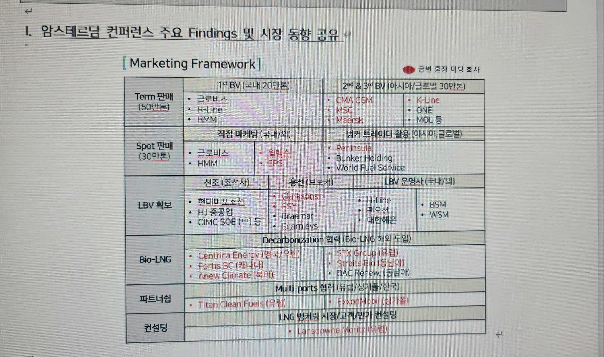
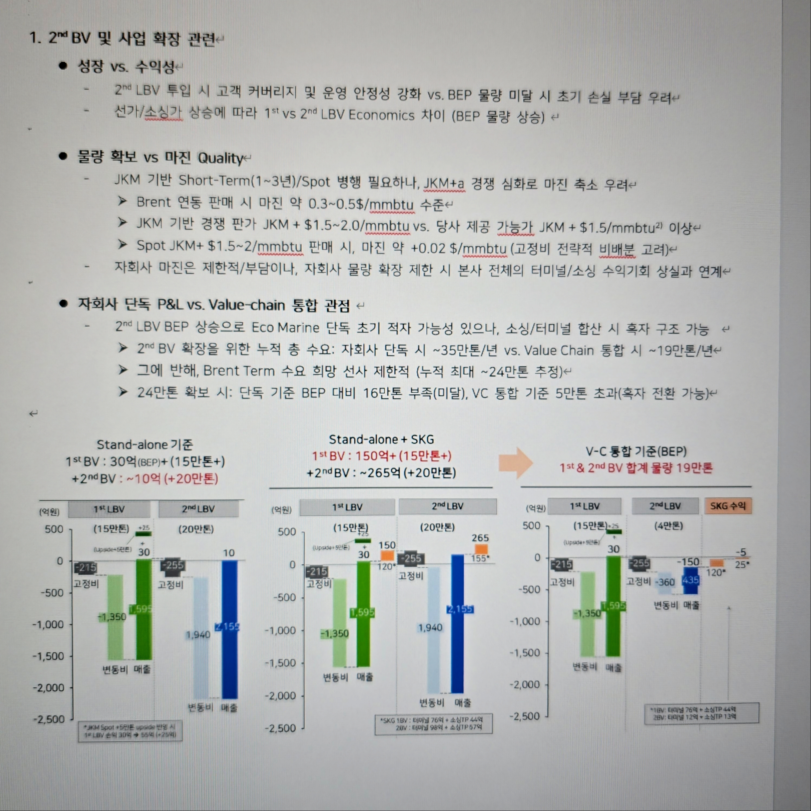
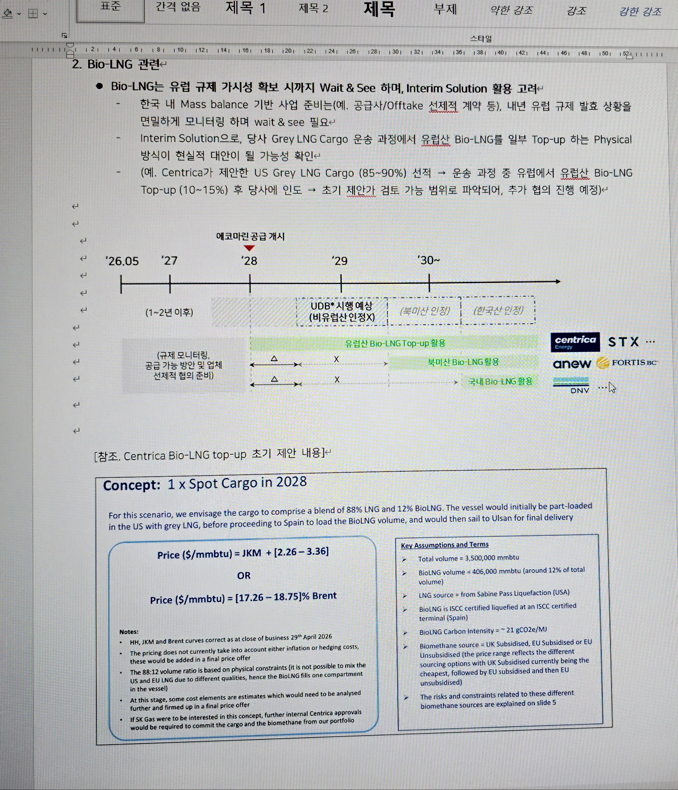

# 벙커링 사업 (EMFS)

  
🚢

  
벙커링 사업 (EMFS)

  
IMO 탄소중립 규제 대응 — LNG 선박 연료 공급 사업 SK가스 100% 자회사 EMFS, 1st LBV (에코프런티어) COD 2027 목표

🎤 <strong>최신 업데이트 (2026.05.28 경영진 보고 — 암스테르담 컨퍼런스 findings + 2nd LBV 의사결정 프레임 반영)</strong>

📋 추진 현황 업데이트 (2026.05.28 보고)

▶ I. 암스테르담 컨퍼런스 주요 Findings (Global Maritime Decarbonization 2026, 5/3~5/9)

<strong>암스테르담 'Global Maritime Decarbonization 2026'</strong> 참가 — 부스 운영, 아시아 LNG 벙커링 시장 패널 토의, 다수 고객 미팅 진행. 시장 내 Eco Marine의 인지도를 높이고 아시아 지역 선도 LNG 벙커링 공급자로서의 입지 강화. Bio-LNG 업체·해외 공급사/Trader와 협의를 통해 시장·규제 동향과 고객 니즈를 입체적으로 점검.

**고객별 미팅 결과**

  

    <strong style="color:#e65100;">🚢 CMA-CGM</strong> — Brent 기반 ~5년 계약에 여전히 관심 있으나, 계약 개시 시점이 '28년인 점으로 내부 우선순위 다소 낮아질 가능성 언급. 
    → 당사의 경쟁력 있는 Brent 1st Tranche 기반 제안가 금년 8월까지 유효함 고지, 조속한 내부 검토 및 협의 가속화 유도 중.
  

  

    <strong style="color:#2e7d32;">🚢 Maersk</strong> — Bio-LNG 관련 업데이트 사항에 지속 관심. '28년 한국 시운전/인도출항 물량 관련, 인도출항 Route 확정 예정인 '27년 초부터 본격 협의 희망. 
    → 금년 중 선박 간 기술적 Compatibility 먼저 진행하며, 물량/가격 협의 지속 계획.
  

  

    <strong style="color:#1565c0;">🚢 K-Line</strong> — 기존 벌크선 1척 논의에서 <strong>추가 벌크선 3~4척 및 한국 기항 PCTC까지 범위 확대.</strong> Brent + JKM 포트폴리오의 장점에 관심 표명. 
    → 금년 6~8월 중 울산 터미널 견학 추진, 현실적 물량 수준 기반 Multi-year 계약 협의 추진 예정.
  

  

    <strong style="color:#880e4f;">🚢 MSC</strong> — 글로벌 최저가 전략 유지. JKM +$0~1/mmbtu 수준 가격 가능 여부 문의. 
    → 대형 고객이나 요구 가격 수준이 과도하게 낮아, <strong>관계는 유지하되 무리한 저가 판매 지양</strong> 검토.
  

  

    <strong style="color:#4a148c;">🚢 윌헴슨</strong> — 현재 LNG DF 비중은 크지 않으나 성장 가능성·한국 기항 가능성 높음 (현대차 PCTC 등). 
    → 우선 기술적 Compatibility 검토 진행, 향후 선대 확대 시점에 맞춰 점진적 물량 확대 추진.
  

**Bio-LNG 동향**

  <strong>시장:</strong> FuelEU 발효로 '25년 급속 증가 → '29년까지 소폭 감소 추이 → FuelEU Phase 2 ('30~) 시 다시 급격 증가 전망. 
  <strong>규제 불확실성:</strong> UDB 발효 시 비EU 생산 Bio-LNG는 유럽 내 효력 인정 불가 우려. 시행 시점은 정치적 이슈와 맞물려 비확정적 (1~2년 후 언급). 
  <strong>시장 규모:</strong> 글로벌 LNG 벙커링 '25년 약 400만톤/년 → '30년 약 2,200만톤/년으로 5배 성장 전망.

**글로벌 Alliance 구축**

  유럽/싱가폴 공급사 등과 협력 의향 확인. Shell 등 글로벌 메이저에 대응하여, 각 지역 주요 LNG 벙커링 공급사와 동일 GTC 기반 상호 공급 back-up 및 고객 pool 확장을 위한 <strong>글로벌 Bunkering Alliance 구축 협의 진행 中</strong> (Titan(유럽), ExxonMobil(싱가폴) 등).

▶ Marketing Framework — 접촉 대상 분류

<table style="width:100%;border-collapse:collapse;font-size:12px;">
  <thead>
    <tr style="background:#006064;color:white;">
      <th style="padding:8px 10px;text-align:left;border:1px solid #004d52;min-width:80px;">구분</th>
      <th style="padding:8px 10px;text-align:left;border:1px solid #004d52;min-width:160px;">1st BV (국내, 20만톤)</th>
      <th style="padding:8px 10px;text-align:left;border:1px solid #004d52;min-width:180px;">2nd &amp; 3rd BV (아시아/글로벌, 30만톤)</th>
    </tr>
  </thead>
  <tbody>
    <tr style="background:#f1f8f1;">
      <td style="padding:8px 10px;border:1px solid #ddd;font-weight:700;color:#2e7d32;vertical-align:top;">Term 판매 (50만톤)</td>
      <td style="padding:8px 10px;border:1px solid #ddd;vertical-align:top;">• 글로비스 • H-Line • HMM</td>
      <td style="padding:8px 10px;border:1px solid #ddd;vertical-align:top;">• CMA CGM • MSC • Maersk • K-Line • ONE • MOL 등</td>
    </tr>
    <tr>
      <td colspan="3" style="padding:4px 10px;border:1px solid #ddd;background:#e0f7fa;font-size:11px;color:#555;">
        직접 마케팅 (국내/외)
        벙커 트레이더 활용 (아시아/글로벌)
      </td>
    </tr>
    <tr style="background:#fff8e1;">
      <td style="padding:8px 10px;border:1px solid #ddd;font-weight:700;color:#e65100;vertical-align:top;">Spot 판매 (30만톤)</td>
      <td style="padding:8px 10px;border:1px solid #ddd;vertical-align:top;">직접 마케팅: • 글로비스 • HMM • 윌헴슨 • EPS</td>
      <td style="padding:8px 10px;border:1px solid #ddd;vertical-align:top;">벙커 트레이더 활용: • Peninsula • Bunker Holding • World Fuel Service</td>
    </tr>
    <tr>
      <td colspan="3" style="padding:4px 10px;border:1px solid #ddd;background:#e0f7fa;font-size:11px;color:#555;">
        신조 (조선사)
        용선 (브로커)
        LBV 운영사 (국내/외)
      </td>
    </tr>
    <tr style="background:#e8eaf6;">
      <td style="padding:8px 10px;border:1px solid #ddd;font-weight:700;color:#283593;vertical-align:top;">LBV 확보</td>
      <td style="padding:8px 10px;border:1px solid #ddd;vertical-align:top;">신조 (조선사): • 현대미포조선 • HJ 중공업 • CIMC SOE (中) 등  용선 (브로커): • Clarksons • SSY • Braemar • Fearnleys</td>
      <td style="padding:8px 10px;border:1px solid #ddd;vertical-align:top;">LBV 운영사 (국내/외): • H-Line • 팬오션 • 대한해운 • BSM • WSM</td>
    </tr>
    <tr>
      <td colspan="3" style="padding:4px 10px;border:1px solid #ddd;background:#e0f7fa;font-size:11px;color:#555;">
        Decarbonization 협력 (Bio-LNG 해외 도입)
      </td>
    </tr>
    <tr style="background:#e8f5e9;">
      <td style="padding:8px 10px;border:1px solid #ddd;font-weight:700;color:#2e7d32;vertical-align:top;">Bio-LNG</td>
      <td style="padding:8px 10px;border:1px solid #ddd;vertical-align:top;">• Centrica Energy (영국/유럽) • Fortis BC (캐나다) • Anew Climate (북미)</td>
      <td style="padding:8px 10px;border:1px solid #ddd;vertical-align:top;">• STX Group (유럽) • Straits Bio (동남아) • BAC Renew. (동남아)</td>
    </tr>
    <tr>
      <td colspan="3" style="padding:4px 10px;border:1px solid #ddd;background:#e0f7fa;font-size:11px;color:#555;">
        Multi-ports 협력 (유럽/싱가폴/한국)
      </td>
    </tr>
    <tr style="background:#f3e5f5;">
      <td style="padding:8px 10px;border:1px solid #ddd;font-weight:700;color:#4a148c;vertical-align:top;">파트너십</td>
      <td colspan="2" style="padding:8px 10px;border:1px solid #ddd;">• Titan Clean Fuels (유럽) • ExxonMobil (싱가폴)</td>
    </tr>
    <tr style="background:#fce4ec;">
      <td style="padding:8px 10px;border:1px solid #ddd;font-weight:700;color:#880e4f;vertical-align:top;">컨설팅</td>
      <td colspan="2" style="padding:8px 10px;border:1px solid #ddd;">LNG 벙커링 시장/고객/판가 컨설팅 • Lansdowne Moritz (유럽)</td>
    </tr>
  </tbody>
</table>

  

▶ Key Takeaways (2026.05.28 보고)

  

    <strong style="color:#e65100;">① Term 수요 — Brent 연동 선사 pool 제한적</strong> 
    전쟁 후 유류 연동가에 대한 일부 고객 선호도 하락으로 Brent 연동 Term 계약 논의 희망 선사가 제한적. 
    계약 기간 감소 추세이며, 공급 개시 1년 전 논의 희망 트렌드 (현 시점 '27년 상반기 → 상세 논의 가능). 
    <strong>Brent 연동 Term 지속 희망 선사: CMA-CGM (~8만톤/년 × 3년~), K-Line (~1만톤/년 × 5년~)</strong>
  

  

    <strong style="color:#1565c0;">② Spot 수요 — 아시아 시장 경쟁가 JKM +$1.5~2.0/mmbtu</strong> 
    JKM Back-to-back 외, 타 Index 매칭 기반 저가 판매 사례 존재. 
    (예. 중국 남부 HH→JKM 매칭, MSC 등에 JKM +~$1/mmbtu 미만 판매) 
    <strong>당사 제공 가능가: JKM +$1.5/mmbtu 이상. Spot 판매 시 마진 약 +$0.02/mmbtu</strong> (고정비 전략적 비배분 고려)
  

  

    <strong style="color:#2e7d32;">③ Bio-LNG — '30년 이후 수요 확장성 명확하나, 규제 불확실성 높음</strong> 
    EU 규제 강화 후 ('30~) 수요 확장성은 명확하나, UDB 시행 시 비EU 생산 물량 비인정 가능성 높음. 
    → '27년 규제 모니터링 후 한국 내 Mass balance 기반 사업 준비 여부 결정 필요.
  

▶ 주요 시사점 및 고민사항 (2026.05.28 보고)

**1. 2nd LBV 및 사업 확장 관련**

  

    <strong style="color:#4a148c;">성장 vs. 수익성</strong> 
    • 2nd LBV 투입 시 고객 커버리지·운영 안정성 강화 vs. BEP 물량 미달 시 초기 손실 부담 
    • 선가/소싱가 상승에 따라 1st vs 2nd LBV Economics 차이 (BEP 물량 상승)
  

  

    <strong style="color:#2e7d32;">물량 확보 vs. 마진 Quality</strong> 
    • JKM 기반 Short-Term(1~3년)/Spot 병행 필요하나, JKM+α 경쟁 심화로 마진 축소 우려 
    • Brent 연동 판매 시 마진 약 $0.5~3.0/mmbtu 수준 
    • Spot JKM+$1.5~2.0/mmbtu 판매 시, 마진 약 +$0.02/mmbtu (고정비 전략적 비배분 고려) 
    • 자회사 마진은 제한적이나, 물량 확장 제한 시 본사 전체의 터미널/소싱 수익기회 상실과 연계
  

  

    <strong style="color:#1565c0;">자회사 단독 P&L vs. Value-chain 통합 관점</strong> 
    • 2nd BV BEP 상승으로 Eco Marine 단독 초기 적자 가능성이나, 소싱/터미널 합산 시 흑자 구조 가능 
    • 2nd BV 확장을 위한 누적 총 수요: <strong>자회사 단독 ~35만톤/년 vs. Value Chain 통합 ~19만톤/년</strong> 
    • Brent Term 수요 희망 선사 제한적 (누적 최대 ~24만톤 추정) 
    • <strong>24만톤 확보 시: 단독 기준 BEP 대비 16만톤 부족, VC 통합 기준 5만톤 초과 (흑자 전환 가능)</strong>
  

  
  
Stand-alone vs. Value-chain 통합 기준 BEP 비교

**2. Bio-LNG 관련**

  유럽 규제 가시성 확보 시까지 <strong>Wait &amp; See</strong>하며, Interim Solution 활용 고려. 
  • 한국 내 Mass balance 기반 사업 준비는 내년 유럽 규제 발효 상황 면밀 모니터링 후 결정 
  • <strong>Interim Solution</strong>: 당사 Grey LNG Cargo 운송 과정에서 유럽산 Bio-LNG를 일부 Top-up 하는 Physical 방식 
  → (예) Centrica 제안: US Grey LNG Cargo (85~90%) 선적 → 운송 중 유럽에서 유럽산 Bio-LNG Top-up (10~15%) 후 당사에 인도. 초기 제안가 검토 가능 범위로 파악, 추가 협의 진행 예정.

  
  
Bio-LNG 규제 일정 및 Centrica Bio-LNG Top-up 제안 구조

**핵심 질문 (의사결정 Framework)**

  <strong style="color:#e65100;">2nd LBV가 SK가스/Eco Marine Value Chain에서 창출하는 "추가 가치"가, 리스크와 자본을 감수할 만큼 충분한가?</strong> 
  → Go/No-go 조건: ① CMA-CGM 8만톤 확보 여부 ② 최소 IRR/NPV 기준 충족 ③ Value Chain 통합 기준 BEP 도달 가능성 ④ 초기 손실 허용 한도 내 여부

💡 이 사업은 왜 존재하는가

국제해사기구(IMO)가 선박 탄소중립을 강제하면서 <strong>LNG 추진선이 급속히 증가</strong>하고 있습니다. SK가스는 이미 울산에 LNG 터미널(KET)을 보유하고 있어, <strong>추가 대규모 투자 없이</strong> 선박 연료 공급 시장에 진입할 수 있는 유일한 국내 사업자입니다. 
울산 KET의 <strong>수심이 얕은 부두를 활용</strong>하는 방법을 고민하다 LNG 벙커링 사업을 시작하게 됨. 기존 인프라를 활용하는 <strong>'자산 재활용'</strong> 비즈니스 모델입니다. 
<strong>핵심 명제: LNG 벙커링은 회사 하나의 이슈가 아닌 LNG 인프라 경쟁력의 싸움. 인프라가 쉽게 지어지지 않으므로 다양한 플레이어가 나오기 어려운 시장.</strong>

💰 어떻게 돈을 버나

    
🔵

    
LNG 조달

    
KET 기존 도입물량 과 통합 Pooling → 단독 Cargo 불필요 소싱 자체 보유

  

&rarr;

    
⚓

    
KET 6번 부두 전용 + 에코프런티어

    
벙커링 전용 부두 (대기 없음 — 차별점) 1호선 9,000톤 적재 건조 완료 '27

  

&rarr;

    
⛽

    
STS 급유 (시몹스 벙커링)

    
Ship-to-Ship 선적 중 동시 급유 빠른 급유 속도 → 인프라 경쟁력

  

&rarr;

    
💵

    
급유 마진

    
JKM+α / Brent / Spot 3개 고객군 네추럴 헷지로 가격경쟁력 확보 목표

  

📊 핵심 수치

  

    
글로벌 시장 ('25)

    
400만 톤

    
LNG 벙커링 연간 물량

  

  

    
공급 희망사

    
150여 개

    
글로벌 벙커링 의향사

  

  

    
한국 시장 ('30E)

    
~90만 톤

    
EMFS 목표 ~50만 톤

  

  

    
1st LBV (에코프런티어)

    
~9,000 톤

    
탱크 18K CBM, COD '27

  

  

    
현대글로비스

    
30척+

    
'25.09.04 계약 체결

  

🌍 글로벌 시장 구도

**Shell이 글로벌 공급량의 약 절반을 장악.** Shell 외 업체들은 Shell에 대항하기 위해 **one alliance** 구축 중 — 유럽 내 벙커링 프로토콜 통일, 계약 조건 표준화가 핵심. 이 구도에 편입돼야 가격 협상력을 가질 수 있음.

**한국 시장 특이점:** 한국은 글로벌 전체에서 포션이 매우 작음. 한국 내 3개 업체가 서로 경쟁하면 싱가포르·중국에 필패. → EMFS 전략: **경쟁하되 이용자 입장에서는 하나의 국가처럼 프로토콜 통일** → 국가 경쟁력으로 승부.

  

    
🇸🇬 싱가포르 — 물동량 최대, 하지만 약점 있음

    
• 글로벌 최대 컨테이너 허브

    
• 캐리어 부두 = 벙커링 부두 → 선박 대기 多, 항상 후순위

    
→ EMFS: 벙커링 전용 부두로 대응

  

  

    
🇨🇳 중국 — 물동량 압도, 하지만 약속 불이행

    
• 상하이·선전·홍콩 각 독립 운영 → 분산, 협력 어려움

    
• 물동량이 많아 고객 약속 불이행·캔슬 多

    
→ EMFS: 신뢰성·안정적 공급으로 대응

  

  

    
🇰🇷 울산/부산 — EMFS 입지 경쟁력

    
• 부산: 글로벌 컨테이너 항 7위

    
• 미국향 선박 → 태평양 횡단 전 연료 탑재 최적지

    
→ 미국향 선박 Captive 수요 확보 유력

  

🎯 EMFS 차별점 — 왜 우리여야 하나

  

    
⚓ 전용 벙커링 부두

    싱가포르는 캐리어·벙커링 부두 혼용 → 후순위. 우리는 KET 6번 전용 부두로 <strong>대기 없는 즉시 급유</strong> 가능.
  

  

    
🔗 소싱+공급 수직통합

    소싱(LNG 도입)도 자체, 공급도 자체 → 중간마진 제거, 네추럴 헷지 → <strong>가격경쟁력 있는 오퍼</strong> 제시 가능.
  

  

    
⚡ 빠른 급유 속도

    LNG 급유 속도 자체가 경쟁력. 선박 입항→급유→출항 시간 단축 → <strong>선사 입장에서 시간 비용 절감</strong>.
  

  

    
🌱 Bio-LNG 공급 능력

    유럽 선사는 Bio-LNG 5~10% 혼합 요구. LNG 85~90% + Bio-LNG 10~15% 혼합 공급 구조 검토 중 → <strong>유럽 고객 접근성</strong>.
  

  

    
🏭 Captive 수요 기반

    현대자동차 LNG 자동차운반선 + 현대중공업 LNG/LPG Dual Fuel 발주 → <strong>초기 Captive 수요</strong>로 사업 안정화.
  

👥 고객 포트폴리오

**급유 물량 기준 (1회)**

| 선종 | 급유 물량 | 주요 고객 |
|------|----------|----------|
| 컨테이너선 | 2,500~4,000 톤 | HMM, CMA CGM, Maersk, MSC |
| 자동차운반선 | ~4,000 톤 | 현대글로비스, H-Line |
| 벌크선 (석탄·철광석) | 1,000~1,500 톤 | 포스코 運搬선 등 |
| 기타 | 1,000~1,500 톤 | Peninsula, 웰헬름슨 등 |

**에코프런티어 (1호선, ~9,000톤) = 컨테이너선 2~3회, 또는 자동차운반선 2~3회 급유 가능**

<strong>전략 포인트 (포럼 발언):</strong> 글로벌 탑10 선사는 모두 대면 미팅 수차례 완료. 단건 계약 경쟁력도 중요하나, <strong>"상대 매트리스(포트폴리오) 안에 어떻게 끼워들어가느냐"가 핵심</strong> — 선사의 전체 LNG 계약 구조에 맞는 조건 제시 필요.

**주요 고객 현황**

| 선사 | 현황 | 비고 |
|------|------|------|
| 현대글로비스 | **'25.09.04 계약 체결** | 자동차운반선 30척+, 1st Term 계약 |
| Maersk | 방문 완료 (4월) | Term 계약 협의 중 |
| CMA CGM | 협의 진행 중 | 글로벌 컨테이너 주요사 |
| HMM | 협의 진행 중 | 현대중공업 Dual Fuel 수혜 |
| MSC, 웰헬름슨, Peninsula 등 | 대면 미팅 완료 | 전세계 10대 업체 포함 |

💹 수익 구조 — 고객 분류

  

    
① JKM + α 고객

    아시아 가스가격 연동. JKM에 마진 알파 추가. 가장 기본적인 구조.
  

  

    
② Brent 고객

    원유가 연동. 유럽계·글로벌 메이저 선사 선호. 장기 Term 계약.
  

  

    
③ Spot 고객

    JKM 가격 무관하게 즉시 공급 필요. 마진은 높으나 불안정.
  

<strong>검토 중 (포럼 발언):</strong> HH(Henry Hub) 믹스 고객과의 연료 믹스 조합을 통해 <strong>옵셔널리티 이익 추가 창출</strong> 방안 설계 중. 숏 교차를 통해 마진 극대화 구조 구축 목표.

🔭 지금 뭘 봐야 하나

📈 기회 / 순풍

✅ 현대글로비스 계약 체결 완료 ('25.09.04)

✅ LNG 발주선이 메탄올 발주선 압도 → LNG 벙커링 수요 우위

✅ 현대중공업 LNG/LPG Dual Fuel 발주 → Captive 수요

✅ 싱가포르 전용부두 不在 — 우리만의 인프라 차별점

✅ 울산항만공사: LNG 급유 회당 1,000만원 지원 (민관 협력)

✅ 선박 수명 20~30년 → 한 번 계약 체결 시 장기 수요 확보

✅ 암모니아 벙커링 확장 가능성 (LPG선→암모니아선 전환)

📉 리스크 / 역풍

⚠️ 2nd LBV 추가 확보 방안 미결 (신조 vs 용선, 국내 vs 해외)

⚠️ 글로벌 컨테이너 선사 Anchor 고객 협의 진행 중 (CMA CGM 등)

⚠️ 한국 LNG 벙커링 전용 제도 미비 — 터미널 30일치 재고의무 비용 부담

⚠️ KOLB(통영, KOGAS), 포스코(광양 12.5K) 국내 경쟁 심화

⚠️ EMFS 단독 손익 vs G&P 통합 손익 관점 논의 미결 → 2nd Vessel 투자 판단 영향

⚠️ Bio-LNG 소싱처·가격체계 미확정

## 추진 타임라인

| 시점 | 마일스톤 |
|------|----------|
| '25.02 | EMFS 설립 |
| **'25.09.04** | **현대글로비스 LNG 공급계약 체결 (자동차운반선 30척+)** |
| '26.04 | Maersk 한국 방문 — Term 계약 협의 |
| '26.06 | 포럼 발표 (DCC 홍종범 실장) — 사업 현황 공개 |
| '26下 | CMA CGM 등 글로벌 고객 계약 추진 |
| **'27.4Q** | **에코프런티어 COD — 1st LBV 사업 개시** |
| '28 | **2nd LBV 도입 목표** (신조/용선 검토 중) |

## 경쟁사 비교

| | EMFS (당사) | KOLB (KOGAS) | 포스코 (광양) |
|---|---|---|---|
| 거점 | **울산 / 부산 인근** | 통영 | 광양 |
| 선박 규모 | **18K CBM (~9,000톤)** | 7.5K CBM | 12.5K CBM |
| 부두 | **벙커링 전용** (KET 6번) | — | — |
| 사업 개시 | **'27~'28** | '23 (기개시) | '26 |
| 타겟 수요 | 미국향·컨테이너·자동차운반선 | 소형선 위주 | 광양 입항 벌크선 (철광석·석탄) |
| 글로벌 경쟁자 | 싱가포르 (물동량), 중국 (가격) | — | — |

<strong>핵심 경쟁 변수 (포럼 발언):</strong> 가격경쟁력은 ① 연료 자체를 싸게 OR ② 공급 인프라 비용을 싸게 하는 것 중 하나. <strong>소싱+공급 수직통합 + 전용 부두 + 민관 지원</strong>이 EMFS의 답. 나머지 조건(프로토콜·계약조건)은 국내 경쟁사와 표준화 → 국가 단위 경쟁력으로 전환.

---
> 출처: 벙커링사업소개 (2026.04.01) · 주간업무보고 (2026.04.13) · DCC 홍종범 실장 포럼 발표 (2026.06.02) · **경영진 보고 — 암스테르담 컨퍼런스 Findings + 2nd LBV 의사결정 Framework (2026.05.28)**
