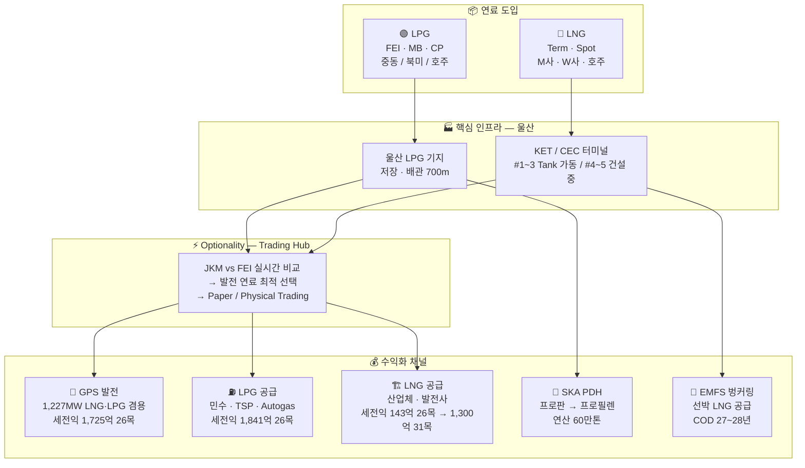

# SK가스 사업 구조 한눈에 이해하기

## SK가스가 뭐하는 회사인가?

**한 줄 요약**: LPG·LNG를 해외에서 조달하여 → 울산의 인프라(기지·터미널·발전소)를 통해 → 전기·연료·원료로 판매하는 에너지 중간상 + 발전사

**핵심 경쟁력**: LNG와 LPG를 **모두** 취급하는 국내 유일 종합 가스사. 가스 두 종류의 가격 차이를 **실시간으로 수익화**할 수 있는 구조(Optionality).

---

## 핵심 수익 메커니즘: Optionality

SK가스가 일반 가스 도매상과 다른 이유는 GPS 발전소가 LNG·LPG 모두 태울 수 있기 때문.

| 시황 | SK가스 행동 | 수익 |
|------|------------|------|
| JKM(LNG가) > FEI(LPG가) | GPS에 LPG 공급 → LNG는 제3자에 Spot 판매 | JKM - FEI - 전환비용 = Spread 수익 |
| JKM < FEI | GPS에 LNG 공급 → LPG는 민수·산업체에 판매 | 정상 운영 |

> '26년 3월 기준: JKM $20.5 vs FEI $16.2 → Spread $4.33/MMBtu. 1.5 Cargo 실행 → **+300억** 확정

---

## 사업 연결 구조도

---

## 사업별 1분 요약

| 사업 | 한 줄 핵심 | 핵심 자산 | 주요 수익 Driver | '26목표 세전익 |
|------|-----------|----------|-----------------|--------------|
| **LPG** | 프로판·부탄 도매 + Trading | 울산 LPG 기지 | FEI/MB Spread, Optionality, Autogas 성장 | **1,841억** |
| **GPS (발전)** | 세계 최초 LNG·LPG 겸용 발전소 | 1,227MW 복합화력 | SMP × 발전량 + 용량요금(CP) | **1,725억** |
| **LNG** | 터미널 확장으로 이익 급성장 중 | KET #1~3 + CEC #4~5 | 터미널 이용료 + Trading + 신규 공급 | **143억 → 1,300억('31)** |
| **벙커링 (EMFS)** | IMO 규제 대응, LNG 선박 연료 공급 | KET 6번 부두, 18K LBV | 선박 급유 마진 | '27~'28 사업 개시 |
| **SKA** | 프로판 → 프로필렌 전환 석화사 | PDH 연산 60만톤 | PDH Spread (프로필렌-프로판) | 구조개편 검토 중 |
| **ESS** | 에너지저장, 준비 중 | — | — | 자료 준비 중 |

---

## 사업 간 연결고리 (어디서 어디로 흐르는가)

| From | To | 내용 |
|------|----|------|
| LPG 도입 | GPS | 발전 연료 (Optionality 실행 시) |
| LPG 도입 | SKA | PDH 원료 (프로판 공급) |
| LPG 도입 | 민수·TSP·Autogas | 충전소·산업체·트럭 연료 공급 |
| LNG 도입 | GPS | 발전 연료 (기본) |
| LNG 도입 | KET 터미널 고객 | UGPS·SKMU·S-Oil·고려아연 등 |
| LNG 도입 | EMFS | 벙커링 선박 연료 공급 ('28~) |
| GPS | 전력시장(KPX) | SMP 가격에 전기 판매 |
| Trading | LNG↔LPG Spread | JKM-FEI 차익 Paper/Physical 수익화 |

---

## 읽으면 좋은 순서 (처음 접하는 분)

1. **이 페이지** — 전체 구조와 Optionality 개념 이해
2. **[전사 실적 개요](/전사실적/)** — 사업별 세전이익 규모 파악
3. **[GPS 발전](/발전/)** — Optionality 메커니즘 상세 이해
4. **[LPG 사업](/LPG/)** — 핵심 수익원 + 시장환경 변화
5. **[LNG 사업](/LNG/)** — 성장 스토리 (143억 → 1,300억)
6. **[벙커링](/벙커링/)** + **[SKA](/SKA/)** — 신사업·구조개편 이슈
